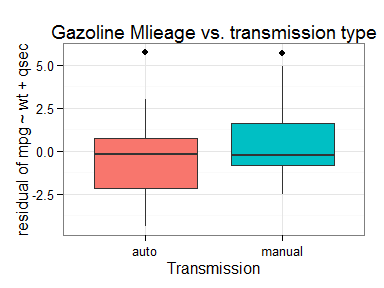

# Impact of Car Transmission Type on Gasoline Mileage
# Introduction

The present analysis was performed in the framework of the "Regression Models" course project (Coursera).
We discuss the impact of car transmission type on Gazoline Mileage, using data from "Motor Trend" magazine (March, April, June and July issues of 1974). The data contains ten physical characteristics of 1973-1974 automobiles and is available in R as the built-in dataset "mtcars". Details regarding the variables can be obtained within R by typing ```?mtcars```, see also the articles from [R.R. Hocking][1] and [H. V. Henderson][2]. A multivariate plot of the data is shown in Fig. 1 of the Appendix. We will specifically try to answer the two folowing questions :

* “Is an automatic or manual transmission better for MPG”
* "Quantify the MPG difference between automatic and manual transmissions"

[1]: http://www.jstor.org/discover/10.2307/2529336?sid=21105393870311&uid=4&uid=3737864&uid=2129&uid=2&uid=70
[2]: http://www.mortality.org/INdb/2008/02/12/8/document.pdf

# Model Selection
Model selection was performed using **best subset selection** and **10-fold cross validation** (CV).
Only models containing the *am* predictors were considered.
The test mean square error (test MSE) obtained from 10-fold CV is minimal and similar for a number of predictors between 3 and 6 (see Fig. A2 of the Appendix). I selected the simplest model, i.e. with 3 variables, which allows for a better interpretability.
**This 3-variables model, denoted $\mathcal{M}_3$, contains the predictors am, wt and qsec and will be the starting point of my analysis**. The use of these three predictors is in agreement with the findings of [R.R. Hocking][1] (see also the discussion by [Henderson][2], page 12). It is to be noted that we only considered here linear combinations of the initial variables. As shown by Henderson, a best model could be obtained by considering higher powers of some predictors (for example the square of wt).

To go further in checking the validity of our model, we compare $\mathcal{M}_3$ with a simpler model (not containing *am*) and more flexible models involving predictors *hp* and *disp* (the latter are also the best 4 and 5 variable models predicted by the cross-validation procedure). Model comparison is performed using ANOVA. As a reminder, Anova performs a $\chi^2$ test to check whether reduction in the residual sum of squares are statistically significant or not (at a default 5% type I error rate). Results are shown below :

```
## Analysis of Variance Table
## 
## Model 1: mpg ~ wt + qsec
## Model 2: mpg ~ wt + qsec + am
## Model 3: mpg ~ wt + qsec + am + hp
## Model 4: mpg ~ wt + qsec + am + hp + disp
##   Res.Df    RSS Df Sum of Sq      F Pr(>F)  
## 1     29 195.46                             
## 2     28 169.29  1   26.1777 4.4358 0.0450 *
## 3     27 160.07  1    9.2195 1.5622 0.2225  
## 4     26 153.44  1    6.6287 1.1232 0.2990  
## ---
## Signif. codes:  0 '***' 0.001 '**' 0.01 '*' 0.05 '.' 0.1 ' ' 1
```

We see that, adding the information about transmission type, the decrease in RSS is statistically significant, while additional variables do not improve the model (p-values > 5%).

# Impact of Transmission Type on Gasoline Mileage

We now look in more details at the linear model involving the 3 predictors *wt*, *qsec* and *am* :

The coefficients for all three predictors are statistically significant. A residual analysis (see Fig. A3 of the appendix)  do not show any clear pattern. It might be necessary for a further analyis to reconsider some outliers such as the Chrysler Imprerial (high residual and leverage).
The model suggests that, for a fixed weight (*wt*) and 1/4 mile time (*qsec*), gazoline Mileage increases in average by ~3 miles per gallon for cars with a manual transmission compared to cars with an automatic transmission. This result is shown below as a boxplot of *mpg* (regressed on *wt* and *qsec*) function of transmission type.


```r
library(ggplot2)
ggplot(mtcars, aes(x = factor(am, labels = c("auto","manual")), y = resid(lm(mpg ~ wt + qsec, mtcars)), fill=as.factor(am) )) +
  geom_boxplot() + theme_bw() + 
  labs(title="Gazoline Mlieage vs. transmission type",
       x = "Transmission",
       y = "residual of mpg ~ wt + qsec") + guides(fill=FALSE)
```

 


# Conclusion


\newpage

# Appendix

 

**Fig. A1 : Exploratory plot of the mtcars dataset.**

 

**Fig. A2 : Test Mean Square Error (MSE) function of the number of predictors p obtained using best subset selection with 10-fold cross validation. Predictor am is forced in all models. We see that a minimal test MSE is achieved for p between 3 and 6, with little difference within this range. For interpretability we can select here the smallest model containing the 3 predictors wt, qsec and am (4, 5 and 6-predictor models respectively add hp, dist and drat variables).**

 

**Fig. A3 : Residual plot of the model $\mathcal{M}_3$ : mpg ~ wt + qsec + am**
